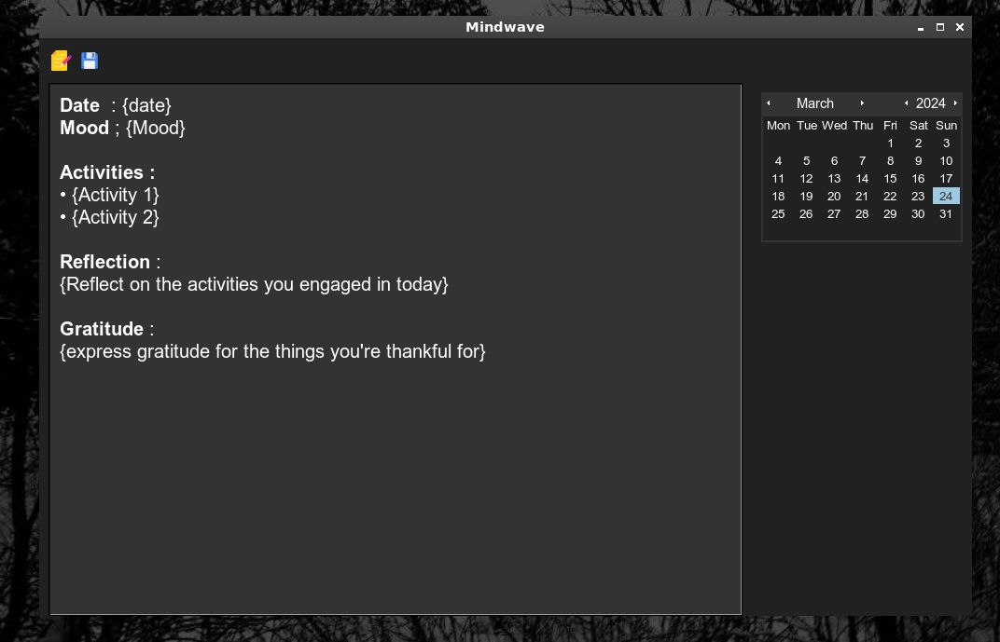

# Mindwave - A Smart way to journal
## Features
- **Smart AI Prompts**: Smart prompts generated by AI helping you journal better.
- **Date-based Entries**: Organize your entries by date for easy navigation and retrieval.
- **Customization**: Personalize your journal with themes, fonts, and other customization options.
- **Secure and offline**: Keep your journal entries safe and secure & offline

## Installation

```bash
git clone https://github.com/tervicke/mindwave.git
pip install -r requirements.txt
make all
```

## Screenshots


## Contact
[my website](tervicke.netlify.app)
