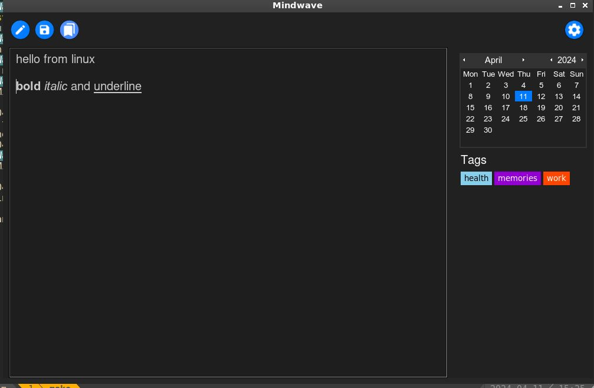

# Mindwave - A simple tool for me and you to journal 
## Features
- **Date-based Entries**: Organize your entries by date for easy navigation and retrieval.
- **Tags**:Add tags to better organize your entries 
- **Customization**: Personalize your journal with themes and accent colors
- **Secure and offline**: Keep your journal entries safe and secure & offline

## Installation
```bash
git clone https://github.com/tervicke/mindwave.git
pip install -r requirements.txt
make 
```

## Screenshots
<table>
  <tr>
    <td></td>
    <td></td>
   <tr>
    <td></td>
    <td></td>
  </tr></table>

## Known issuses
- [ ] dropdown in the settings doesnt work correctly in windows
- [ ] tags section doesnt change with the change theme 
- [ ] red accent color isnt fully supported

## Exploring Features
- [ ] image support

## Contact
[my website](tervicke.netlify.app)


