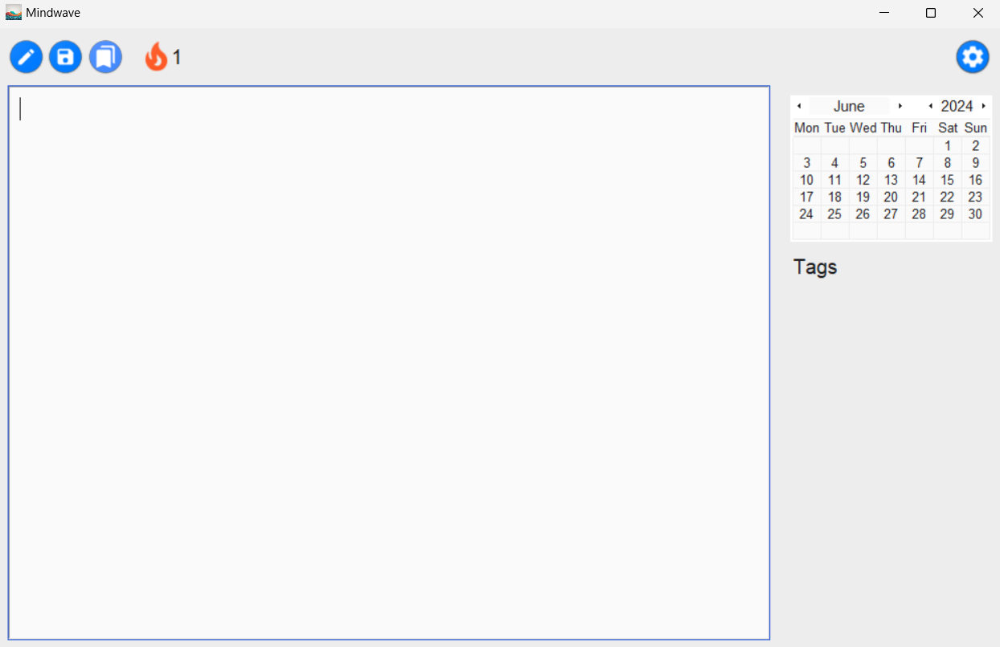
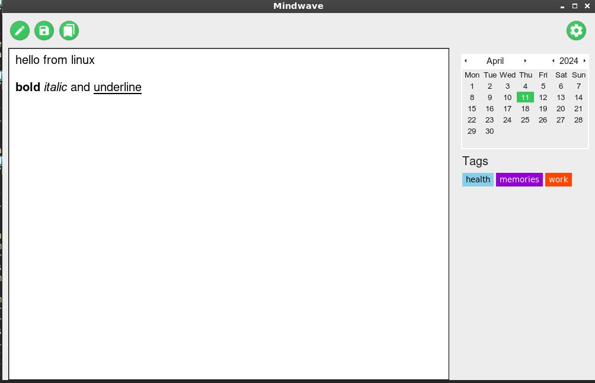

# Mindwave - a dead simple tool for me and you to journal 
## Features
- **Date-based Entries**: Organize your entries by date for easy navigation and retrieval.
- **tags**:Add tags to better organize your entries 
- **Customization**: Personalize your journal with themes, fonts, and other customization options.
- **Secure and offline**: Keep your journal entries safe and secure & offline

## Installation

```bash
git clone https://github.com/tervicke/mindwave.git
pip install -r requirements.txt

make all
```

## Screenshots

<table>
  <tr>
    <td></td>
    <td></td>
   <tr>
    <td></td>
    <td></td>
  </tr></table>


## Contact
[my website](tervicke.netlify.app)
